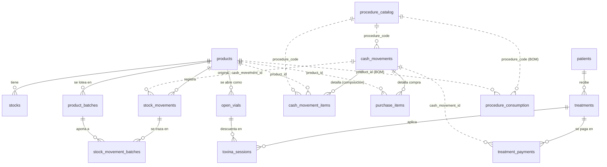

# Modelo de base de datos — `stock-control-api`

> PostgreSQL (Neon en producción). El esquema lo genera Hibernate desde las
> entidades (`ddl-auto: update`). Dos vistas:
>
> - **DER (Diagrama Entidad-Relación):** conceptual, entidades + cardinalidades.
> - **DLR (Diagrama Lógico-Relacional):** físico, todas las columnas + claves.
>
> **Convención de líneas** (clave para entender el desacople del sistema):
> **línea llena `——` = FK real** garantizada por la BD;
> **línea punteada `- -` = referencia lógica** (columna UUID/`code` suelta, sin
> FK, integridad delegada al código). Ver la lista completa de referencias
> lógicas más abajo.

---

## 1. DER — modelo conceptual (cardinalidades)

**Entidades sin relaciones estructurales** (tablas "sueltas" a propósito):
`app_users`, `expenses`, `cash_daily_close`. La caja diaria (`cash_daily_close`)
es un *snapshot* de totales; no referencia movimientos individuales.

> `Stock` (objeto de valor `productId/current/minimum`) **no es tabla**: se
> calcula en memoria. La tabla persistida es `stocks` (`StockEntity`).

---

## 2. DLR — modelo lógico-relacional (columnas + claves)

`PK` = primary key · `FK` = foreign key (llena) · `UK` = unique. Todas las
entidades que extienden `BaseEntity` heredan `id`, `created_at`, `updated_at`.

```mermaid
erDiagram
    app_users {
        uuid id PK
        varchar firebase_uid UK
        varchar email UK
        varchar role "enum Role"
        boolean enabled
        timestamptz created_at
    }

    products {
        uuid id PK
        varchar name
        varchar description
        int minimum_stock
        boolean active
        varchar category "enum ProductCategory"
        varchar brand "enum ProductBrand"
        boolean expirable
        varchar barcode UK
        varchar scope "enum ProductScope"
        numeric cost_price
        numeric sale_price
        numeric default_markup_percentage
        varchar consumption_unit "enum ConsumptionUnit"
        int units_per_package
        int shelf_life_months
        int restock_priority
        timestamptz created_at
        timestamptz updated_at
    }

    stocks {
        uuid id PK
        uuid product_id FK
        varchar context "enum StockContext"
        int current_stock
        bigint version "lock optimista"
    }

    product_batches {
        uuid id PK
        uuid product_id FK
        varchar context "enum StockContext"
        varchar lot_number
        int quantity_initial
        int quantity_current
        date expiration_date
        boolean expiration_estimated
        timestamptz created_at
        timestamptz updated_at
    }

    stock_movements {
        uuid id PK
        uuid product_id FK
        varchar type "enum StockMovementType"
        varchar reason_type "enum StockMovementReason"
        int quantity
        varchar comment
        varchar context "enum StockContext"
        uuid cash_movement_id "ref logica, sin FK"
        timestamptz created_at
        timestamptz updated_at
    }

    stock_movement_batches {
        uuid id PK
        uuid stock_movement_id FK
        uuid batch_id FK
        int quantity
        timestamptz created_at
        timestamptz updated_at
    }

    cash_movements {
        uuid id PK
        varchar type "enum CashMovementType"
        varchar source "enum CashSource"
        varchar payment_method "enum PaymentMethod"
        varchar context "enum CashContext"
        numeric amount "bruto"
        numeric retention
        numeric net_amount "amount - retention"
        varchar comment
        varchar detail
        uuid reference_id "ref logica polimorfica"
        numeric doctor_share
        numeric cosmetologist_share
        boolean voided
        timestamptz voided_at
        varchar void_reason
        varchar voided_by
        varchar procedure_code "ref logica a catalog.code"
        timestamptz created_at
        timestamptz updated_at
    }

    cash_movement_items {
        uuid id PK
        uuid cash_movement_id FK
        varchar kind "enum CashMovementItemKind"
        uuid product_id "ref logica (kind=PRODUCT)"
        varchar procedure_code "ref logica (kind=PROCEDURE)"
        varchar description
        int quantity
        numeric unit_amount
        numeric subtotal
        varchar performed_by "enum CashActor, nullable"
        varchar split_preset "enum SplitPreset, solo peeling"
        numeric doctor_share
        numeric cosmetologist_share
        timestamptz created_at
        timestamptz updated_at
    }

    cash_daily_close {
        uuid id PK
        date close_date
        varchar context "enum CashContext"
        numeric cash_net
        numeric transfer_net
        numeric debit_net
        numeric credit_net
        numeric total_in
        numeric total_out
        numeric net_total
        varchar closed_by
        varchar note
        timestamptz created_at
        timestamptz updated_at
    }

    patients {
        uuid id PK
        varchar first_name
        varchar last_name
        varchar dni UK "nullable, unico si presente"
        varchar phone
        timestamptz created_at
        timestamptz updated_at
    }

    treatments {
        uuid id PK
        uuid patient_id FK
        varchar code "protocolo"
        varchar description
        numeric total_amount
        numeric paid_amount
        numeric cosmetologist_fixed_share
        int max_installments
        varchar status "enum TreatmentStatus"
        timestamptz created_at
        timestamptz updated_at
    }

    treatment_payments {
        uuid id PK
        uuid treatment_id FK
        numeric amount
        varchar payment_method "enum PaymentMethod"
        int installment_number
        uuid cash_movement_id "ref logica"
        numeric doctor_share
        numeric cosmetologist_share
        varchar comment
        timestamptz created_at
        timestamptz updated_at
    }

    procedure_catalog {
        uuid id PK
        varchar code UK "clave de agregacion global"
        varchar label
        varchar kind "enum ProcedureKind"
        varchar performed_by "enum CashActor"
        numeric doctor_percent
        numeric cosmetologist_percent
        numeric amount "null = a convenir"
        boolean active "soft-delete"
        varchar special_flow "enum ProcedureSpecialFlow"
        timestamptz created_at
        timestamptz updated_at
    }

    procedure_consumption {
        uuid id PK
        varchar procedure_code "ref logica a catalog.code"
        uuid product_id "ref logica a products"
        int quantity "en unidad consumible"
        timestamptz created_at
        timestamptz updated_at
    }

    purchase_items {
        uuid id PK
        uuid cash_movement_id FK
        uuid product_id "ref logica"
        varchar product_name "snapshot"
        int quantity "en envases"
        numeric unit_cost
        numeric subtotal
        varchar lot_number
        date expiration_date
        timestamptz created_at
        timestamptz updated_at
    }

    expenses {
        uuid id PK
        varchar type "enum ExpenseType"
        varchar context "enum ExpenseContext"
        numeric amount
        varchar comment
        boolean recurring
        timestamptz created_at
        timestamptz updated_at
    }

    open_vials {
        uuid id PK
        uuid product_id FK
        timestamptz opened_at
        timestamptz expires_at "opened_at + 20 dias"
        int total_units "100 Xeomin"
        int units_remaining
        varchar status "enum OpenVialStatus"
        timestamptz created_at
        timestamptz updated_at
    }

    toxina_sessions {
        uuid id PK
        uuid treatment_id FK
        uuid open_vial_id FK
        int session_number
        timestamptz performed_at
        int units_used
        timestamptz created_at
        timestamptz updated_at
    }

    products             ||--o{ stocks                 : ""
    products             ||--o{ product_batches        : ""
    products             ||--o{ stock_movements        : ""
    products             ||--o{ open_vials             : ""
    stock_movements      ||--o{ stock_movement_batches : ""
    product_batches      ||--o{ stock_movement_batches : ""
    cash_movements       ||--o{ cash_movement_items    : ""
    cash_movements       ||--o{ purchase_items         : ""
    patients             ||--o{ treatments             : ""
    treatments           ||--o{ treatment_payments     : ""
    treatments           ||--o{ toxina_sessions        : ""
    open_vials           ||--o{ toxina_sessions        : ""
```

---

## 3. Claves, constraints e índices (referencia)

### Claves únicas (UNIQUE)

| Tabla | Constraint | Columnas |
|---|---|---|
| `app_users` | (implícita) | `firebase_uid` |
| `app_users` | (implícita) | `email` |
| `products` | (implícita) | `barcode` |
| `stocks` | `uq (product_id, context)` | **compuesta** |
| `cash_daily_close` | `uq_cash_daily_close_ctx_date` | **compuesta** `(context, close_date)` |
| `patients` | (implícita) | `dni` (permite múltiples NULL) |
| `procedure_catalog` | `uq_procedure_catalog_code` | `code` |
| `procedure_consumption` | `uq_procedure_consumption` | **compuesta** `(procedure_code, product_id)` |

### Índices declarados

| Tabla | Índice | Columnas |
|---|---|---|
| `stocks` | `idx_stocks_product_context` | `product_id, context` |
| `product_batches` | `idx_product_batches_product_context` | `product_id, context` |
| `product_batches` | `idx_product_batches_expiration_date` | `expiration_date` |
| `stock_movements` | `idx_stock_movements_product_context` | `product_id, context` |
| `stock_movements` | `idx_stock_movements_type` | `type` |
| `stock_movements` | `idx_stock_movements_cash_movement` | `cash_movement_id` |
| `stock_movement_batches` | `idx_smb_movement` / `idx_smb_batch` | `stock_movement_id` / `batch_id` |
| `cash_movements` | `idx_cash_context` / `idx_cash_created_at` | `context` / `created_at` |
| `cash_movement_items` | `idx_cmi_movement` / `idx_cmi_product` / `idx_cmi_performed_by` | `cash_movement_id` / `product_id` / `performed_by` |
| `patients` | `idx_patient_dni` / `idx_patient_lastname` | `dni` / `last_name` |
| `treatments` | `idx_treatment_patient` / `idx_treatment_status` | `patient_id` / `status` |
| `treatment_payments` | `idx_payment_treatment` **y** `idx_treatment_payment_treatment` | `treatment_id` (⚠ dos índices sobre lo mismo) |
| `procedure_catalog` | `idx_procedure_catalog_active` | `active` |
| `procedure_consumption` | `idx_proc_consumption_code` | `procedure_code` |
| `purchase_items` | `idx_purchase_items_movement` / `idx_purchase_items_product` | `cash_movement_id` / `product_id` |
| `open_vials` | `idx_open_vial_status` / `idx_open_vial_product` | `status` / `product_id` |
| `toxina_sessions` | `idx_toxina_session_treatment` / `idx_toxina_session_vial` | `treatment_id` / `open_vial_id` |

### Referencias lógicas (columnas SIN FK, integridad por código)

| Origen (columna) | Apunta a | Por qué no es FK |
|---|---|---|
| `stock_movements.cash_movement_id` | `cash_movements.id` | *stock* no debe depender de *caja*; puede no haber caja detrás (consumo, ajuste). |
| `cash_movement_items.product_id` | `products.id` | El ítem puede ser PROCEDURE (sin producto). |
| `cash_movement_items.procedure_code` | `procedure_catalog.code` | Se referencia por `code` (clave de agregación), no por `id`. |
| `cash_movements.procedure_code` | `procedure_catalog.code` | idem. |
| `cash_movements.reference_id` | venta / gasto / pago | **Polimórfica**: no puede ser una sola FK. |
| `treatment_payments.cash_movement_id` | `cash_movements.id` | El pago contextualiza; la verdad del dinero es `cash_movements`. |
| `procedure_consumption.procedure_code` | `procedure_catalog.code` | BOM referenciado por `code`. |
| `procedure_consumption.product_id` | `products.id` | desacople del catálogo. |
| `purchase_items.product_id` | `products.id` | guarda además `product_name` como snapshot histórico. |

---

## 4. Notas para la fase de refactor (BD)

1. **`treatment_payments` está mapeada por DOS entidades** (`Payment` y
   `TreatmentPayment`) con columnas parcialmente distintas. En la BD es una sola
   tabla, así que hoy conviven columnas de ambas (`installment_number` de una;
   `doctor_share`/`cosmetologist_share`/`comment` de la otra). Es la primera
   corrección a encarar: unificar en una entidad o separar tablas.
2. **Índice duplicado** en `treatment_payments` (`idx_payment_treatment` y
   `idx_treatment_payment_treatment` cubren `treatment_id`). Dejar uno.
3. Al migrar a **Flyway + `ddl-auto: validate`**, este documento es la línea de
   base: cada tabla acá listada debe existir idéntica antes de que `validate`
   pase. Conviene generar el DDL actual (`ddl-auto: create` en una BD vacía,
   capturar el SQL) y versionarlo como `V1__baseline.sql`.
4. Las referencias lógicas que viven **dentro de un mismo módulo** y donde el
   acople es aceptable son candidatas a promover a FK real (con `ON DELETE`
   explícito). Las inter-módulo conviene dejarlas como están y documentarlas.
