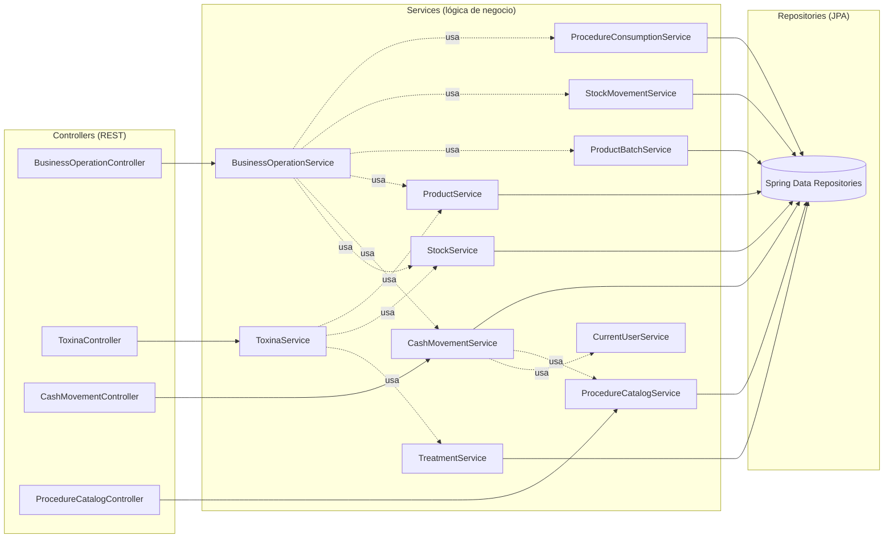

# Diagrama UML de clases — `stock-control-api`

> Modelo de dominio del backend (Spring Boot + Hibernate). Renderiza solo en
> GitHub. Las columnas exhaustivas de cada tabla están en
> [`base-de-datos.md`](./base-de-datos.md); acá el foco son las **clases y sus
> relaciones**.

## Cómo leer los conectores

| Conector Mermaid | Relación UML | Qué significa en este proyecto |
|---|---|---|
| `A <|-- B` | **Generalización / herencia** | `B extends A`. Casi todas las entidades extienden `BaseEntity`. |
| `A "1" *-- "0..*" B` | **Composición** | `A` es dueño del ciclo de vida de `B`. Se implementa con `cascade = ALL` + `orphanRemoval = true`: si se borra `A`, se borran sus `B`. |
| `A "0..*" --> "1" B` | **Asociación (navegable)** | FK real (`@ManyToOne` con `@JoinColumn`). `A` conoce a `B` y la BD lo garantiza con constraint. |
| `A ..> B` | **Dependencia / «referencia lógica»** | `A` guarda el `id`/`code` de `B` en una columna suelta (UUID o String), **a propósito sin FK**, para desacoplar módulos. La integridad la cuida el código, no la BD. |

La distinción asociación vs. dependencia es la decisión de diseño central del
sistema: los módulos se hablan por **referencias lógicas** (UUID/`code` sueltos)
en vez de FKs cuando no queremos acoplarlos. Ej.: el módulo de *stock* no
depende del de *caja*, por eso `StockMovement.cashMovementId` es un `UUID` y no
un `@ManyToOne`.

---

## 1. Diagrama de clases (estructural)

```mermaid
classDiagram
    direction LR

    class BaseEntity {
        <<abstract>>
        +UUID id
        +Instant createdAt
        +Instant updatedAt
    }

    %% ===================== IDENTIDAD / USUARIOS =====================
    class AppUser {
        +UUID id
        +String firebaseUid
        +String email
        +Role role
        +boolean enabled
        +Instant createdAt
    }

    %% ===================== CATÁLOGO / PRODUCTOS =====================
    class Product {
        +String name
        +String barcode
        +ProductCategory category
        +ProductBrand brand
        +ProductScope scope
        +BigDecimal costPrice
        +BigDecimal salePrice
        +ConsumptionUnit consumptionUnit
        +Integer unitsPerPackage
        +Integer minimumStock
        +Integer shelfLifeMonths
        +Integer restockPriority
        +Boolean expirable
        +Boolean active
    }

    %% ===================== STOCK =====================
    class Stock {
        <<value object>>
        +UUID productId
        +int current
        +int minimum
        +isBelowMinimum() boolean
    }
    class StockEntity {
        +UUID id
        +StockContext context
        +int current
        +Long version
    }
    class ProductBatch {
        +StockContext context
        +String lotNumber
        +Integer quantityInitial
        +Integer quantityCurrent
        +LocalDate expirationDate
        +Boolean expirationEstimated
    }
    class StockMovement {
        +StockMovementType type
        +StockMovementReason reasonType
        +Integer quantity
        +StockContext context
        +UUID cashMovementId
    }
    class StockMovementBatch {
        +Integer quantity
    }

    %% ===================== CAJA =====================
    class CashMovement {
        +CashMovementType type
        +CashSource source
        +PaymentMethod paymentMethod
        +CashContext context
        +BigDecimal amount
        +BigDecimal retention
        +BigDecimal netAmount
        +BigDecimal doctorShare
        +BigDecimal cosmetologistShare
        +String procedureCode
        +UUID referenceId
        +boolean voided
        +Instant voidedAt
        +String voidedBy
    }
    class CashMovementItem {
        +CashMovementItemKind kind
        +UUID productId
        +String procedureCode
        +String description
        +Integer quantity
        +BigDecimal unitAmount
        +BigDecimal subtotal
        +CashActor performedBy
        +SplitPreset splitPreset
        +BigDecimal doctorShare
        +BigDecimal cosmetologistShare
    }
    class CashDailyClose {
        +LocalDate closeDate
        +CashContext context
        +BigDecimal cashNet
        +BigDecimal transferNet
        +BigDecimal debitNet
        +BigDecimal creditNet
        +BigDecimal totalIn
        +BigDecimal totalOut
        +BigDecimal netTotal
        +String closedBy
    }

    %% ===================== PACIENTES / TRATAMIENTOS =====================
    class Patient {
        +String firstName
        +String lastName
        +String dni
        +String phone
    }
    class Treatment {
        +String code
        +String description
        +BigDecimal totalAmount
        +BigDecimal paidAmount
        +BigDecimal cosmetologistFixedShare
        +Integer maxInstallments
        +TreatmentStatus status
    }
    class Payment {
        +BigDecimal amount
        +PaymentMethod paymentMethod
        +Integer installmentNumber
        +UUID cashMovementId
    }
    class TreatmentPayment {
        +BigDecimal amount
        +PaymentMethod paymentMethod
        +UUID cashMovementId
        +BigDecimal doctorShare
        +BigDecimal cosmetologistShare
    }

    %% ===================== PROCEDIMIENTOS / BOM =====================
    class ProcedureCatalog {
        +String code
        +String label
        +ProcedureKind kind
        +CashActor performer
        +BigDecimal doctorPercent
        +BigDecimal cosmetologistPercent
        +BigDecimal amount
        +boolean active
        +ProcedureSpecialFlow specialFlow
    }
    class ProcedureConsumption {
        +String procedureCode
        +UUID productId
        +Integer quantity
    }

    %% ===================== COMPRAS / GASTOS =====================
    class PurchaseItem {
        +UUID productId
        +String productName
        +Integer quantity
        +BigDecimal unitCost
        +BigDecimal subtotal
        +String lotNumber
        +LocalDate expirationDate
    }
    class Expense {
        +ExpenseType type
        +ExpenseContext context
        +BigDecimal amount
        +boolean recurring
    }

    %% ===================== TOXINA =====================
    class OpenVial {
        +Instant openedAt
        +Instant expiresAt
        +Integer totalUnits
        +Integer unitsRemaining
        +OpenVialStatus status
    }
    class ToxinaSession {
        +Integer sessionNumber
        +Instant performedAt
        +Integer unitsUsed
    }

    %% ===================== HERENCIA =====================
    BaseEntity <|-- Product
    BaseEntity <|-- ProductBatch
    BaseEntity <|-- StockMovement
    BaseEntity <|-- StockMovementBatch
    BaseEntity <|-- CashMovement
    BaseEntity <|-- CashMovementItem
    BaseEntity <|-- CashDailyClose
    BaseEntity <|-- Patient
    BaseEntity <|-- Treatment
    BaseEntity <|-- Payment
    BaseEntity <|-- TreatmentPayment
    BaseEntity <|-- ProcedureCatalog
    BaseEntity <|-- ProcedureConsumption
    BaseEntity <|-- PurchaseItem
    BaseEntity <|-- Expense
    BaseEntity <|-- OpenVial
    BaseEntity <|-- ToxinaSession
    %% AppUser, StockEntity y Stock NO extienden BaseEntity (id propio o POJO)

    %% ===================== COMPOSICIÓN =====================
    CashMovement "1" *-- "0..*" CashMovementItem : items
    Treatment "1" *-- "0..*" Payment : payments

    %% ===================== ASOCIACIÓN (FK real) =====================
    StockEntity "0..*" --> "1" Product : product
    ProductBatch "0..*" --> "1" Product : product
    StockMovement "0..*" --> "1" Product : product
    StockMovementBatch "0..*" --> "1" StockMovement : stockMovement
    StockMovementBatch "0..*" --> "1" ProductBatch : batch
    Treatment "0..*" --> "1" Patient : patient
    TreatmentPayment "0..*" --> "1" Treatment : treatment
    PurchaseItem "0..*" --> "1" CashMovement : cashMovement
    OpenVial "0..*" --> "1" Product : product
    ToxinaSession "0..*" --> "1" Treatment : treatment
    ToxinaSession "0..*" --> "1" OpenVial : openVial

    %% ===================== DEPENDENCIA (referencia lógica, sin FK) =====================
    StockMovement ..> CashMovement : cashMovementId
    CashMovementItem ..> Product : productId
    CashMovementItem ..> ProcedureCatalog : procedureCode
    CashMovement ..> ProcedureCatalog : procedureCode
    Payment ..> CashMovement : cashMovementId
    TreatmentPayment ..> CashMovement : cashMovementId
    ProcedureConsumption ..> ProcedureCatalog : procedureCode
    ProcedureConsumption ..> Product : productId
    PurchaseItem ..> Product : productId

    note for CashMovement "referenceId apunta polimórficamente a venta / gasto / pago, sin FK"
    note for Stock "No es entidad JPA: se arma en memoria en StockService a partir de StockEntity"
```

### Notas de diseño que se leen en el diagrama

- **`CashMovement` es un agregado.** Es la raíz de una composición con
  `CashMovementItem`. El detalle (productos/procedimientos de una venta) no vive
  fuera de su movimiento. `addItem()` es el único punto de alta y setea el lado
  dueño de la relación.
- **`Treatment` es otro agregado** (con `Payment`). Modela el protocolo con
  cuotas (peeling, toxina): `paidAmount` y `status` se recalculan a medida que
  entran `Payment`.
- **`performedBy` en `CashMovementItem`** es la corrección del incidente de fuga
  de datos: antes la autoría se *inferían* del monto; ahora se **persiste**.
- **`Stock` (VO) vs `StockEntity`.** `StockEntity` es la fila persistida (con
  `@Version` para lock optimista); `Stock` es un objeto de valor que
  `StockService` arma para exponer "actual vs mínimo" sin filtrar la entidad.

---

## 2. Enumeraciones del dominio

Los enums no se dibujan en el diagrama principal para no saturarlo. Acá el
catálogo completo (todos se persisten como `EnumType.STRING`):

```mermaid
classDiagram
    direction LR

    class Role {
        <<enumeration>>
        ADMIN
        USER
        COSMETOLOGA
        PENDING
    }
    class CashActor {
        <<enumeration>>
        MEDICA
        COSMETOLOGA
    }
    class CashContext {
        <<enumeration>>
        LOCAL
        CONSULTORIO
        +toStockContext() StockContext
    }
    class StockContext {
        <<enumeration>>
        LOCAL
        CONSULTORIO
    }
    class CashMovementType {
        <<enumeration>>
        IN
        OUT
    }
    class CashSource {
        <<enumeration>>
        PRODUCT_SALE
        PROCEDURE
        EXPENSE
        PROVIDER_PAYMENT
        ADJUSTMENT
        COMBINED_SALE
    }
    class PaymentMethod {
        <<enumeration>>
        CASH
        TRANSFER
        DEBIT
        CREDIT
        +isCard() boolean
    }
    class CashMovementItemKind {
        <<enumeration>>
        PRODUCT
        PROCEDURE
    }
    class SplitPreset {
        <<enumeration>>
        NORMAL
        TODO_COSMETOLOGA
        TODO_MEDICA
    }
    class PeelingPaymentKind {
        <<enumeration>>
        FULL
        FIRST
        SECOND
    }
    class ProcedureKind {
        <<enumeration>>
        MEDICA
        COSMETOLOGIA
    }
    class ProcedureSplitRule {
        <<enumeration>>
        MEDICA_100
        COSMO_70_30
        COSMO_50_50
    }
    class ProcedureSpecialFlow {
        <<enumeration>>
        NONE
        TOXINA_VIAL
    }
    class TreatmentStatus {
        <<enumeration>>
        PENDIENTE
        PARCIAL
        COMPLETO
    }
    class OpenVialStatus {
        <<enumeration>>
        OPEN
        DEPLETED
        EXPIRED
    }
    class StockMovementType {
        <<enumeration>>
        INIT
        IN
        OUT
        ADJUST
    }
    class StockMovementReason {
        <<enumeration>>
        COMPRA_PROVEEDOR
        VENTA
        USO_CAMILLA
        PROCEDIMIENTO
        ANULACION
        AJUSTE_ERROR
        VENCIMIENTO
        TRASLADO
        USO_PERSONAL
        MUESTRA
        REGALO
        PEDIDO_ESPECIAL
        OTRO
    }
    class ConsumptionUnit {
        <<enumeration>>
        UNIDAD
        ML
        AMPOLLA
        DISPARO
    }
    class ProductCategory {
        <<enumeration>>
        COSMETICO_VENTA
        INSUMO_CAMILLA
        INSUMO_DESCARTABLE
        MESOTERAPIA
        OTRO
    }
    class ProductScope {
        <<enumeration>>
        LOCAL
        CONSULTORIO
        BOTH
    }
    class ExpenseType {
        <<enumeration>>
        RENT
        SERVICES
        PROVIDER
        SALARY
        OTHER
    }
    class ExpenseContext {
        <<enumeration>>
        LOCAL
        CONSULTORIO
        SHARED
    }
    %% ProductBrand tiene ~23 valores (marcas), se omite el listado.
```

> **`ProductSplitRule` es la fuente de la verdad del reparto.** `ProcedureCatalog`
> guarda `doctorPercent`/`cosmetologistPercent` desnormalizados, pero **siempre**
> se setean desde una `ProcedureSplitRule` en `ProcedureCatalogService`. El
> frontend refleja la regla vía `procedureShares()` pero nunca la posee.

---

## 3. Relaciones "de uso" en la capa de servicios

El diagrama de clases muestra el uso a nivel *dato* (referencias lógicas). A
nivel *aplicación*, el uso se ve en cómo los servicios se orquestan.
`BusinessOperationService` es el orquestador (fachada) que coordina una venta o
un procedimiento de punta a punta.

**Lectura:** `BusinessOperationService` depende de 6 servicios. Es el punto
donde una operación de negocio (vender, comprar, hacer un procedimiento) se
descompone en: descontar stock → registrar caja → mover lote → consumir receta.
Es también el mejor candidato a partir en la fase de refactor (hoy concentra
demasiada responsabilidad).

---

## 4. Deuda técnica visible en el modelo (para la fase de refactor)

1. **`Payment` y `TreatmentPayment` mapean a la MISMA tabla `treatment_payments`.**
   Son dos `@Entity` distintas apuntando a `@Table(name = "treatment_payments")`.
   Esto es ambiguo y frágil: Hibernate valida contra la misma tabla dos modelos
   con columnas distintas. Hay que unificar en una sola entidad o separar tablas.
2. **Dependencia `mssql-jdbc` viva en el `pom.xml`** (herencia de la etapa SQL
   Server; hoy es Postgres/Neon). Se puede quitar.
3. Las **referencias lógicas** (UUID/`code` sueltos) son una decisión válida de
   desacople, pero conviene documentarlas y, donde el acople sí es aceptable
   (ej. dentro del mismo módulo), evaluar promoverlas a FK con
   `ddl-auto: validate` + Flyway.
